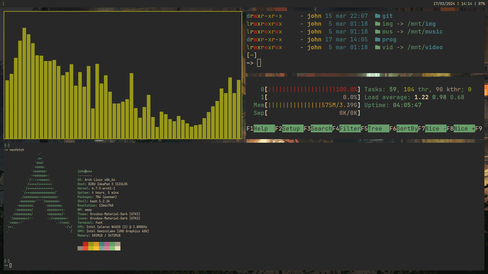

# dotfiles

Minhas dotfiles, contendo um setup para o Sway, configurações do editor de texto [Helix](https://helix-editor.com), 
configurações do emulador de terminal [Foot](https://codeberg.org/dnkl/foot), e uma versão customizada das 
configurações do Rofi feitas por [Oglo12](https://gitlab.com/Oglo12).  

Os wallpapers foram baixados [daqui](https://gruvbox-wallpapers.pages.dev/).

## Preview  

