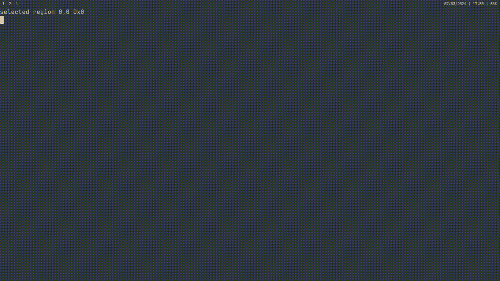

# dotfiles

Minhas dotfiles, contendo um setup para o Sway, configurações para o editor de texto [Helix](https://helix-editor.com), configurações do emulador de terminal [Foot](https://codeberg.org/dnkl/foot), e uma versão customizada das configurações do Rofi feitas por [Oglo12](https://gitlab.com/Oglo12).  

Há também um script para trocar a paleta de cores do setup, basta executar o comando ```tema``` no Rofi ou apertar ```Super + t```, para escolher o tema desejado.

### Preview


Além desse script, há outros como por exemplo o ```manager```, um navegador de arquivos simples para o Rofi, feito pelo [Oglo12](https://gitlab.com/Oglo12), e o ```cvrt```, um wrapper para o ffmpeg feito pelo [Denshi](https://www.youtube.com/@Denshi).
